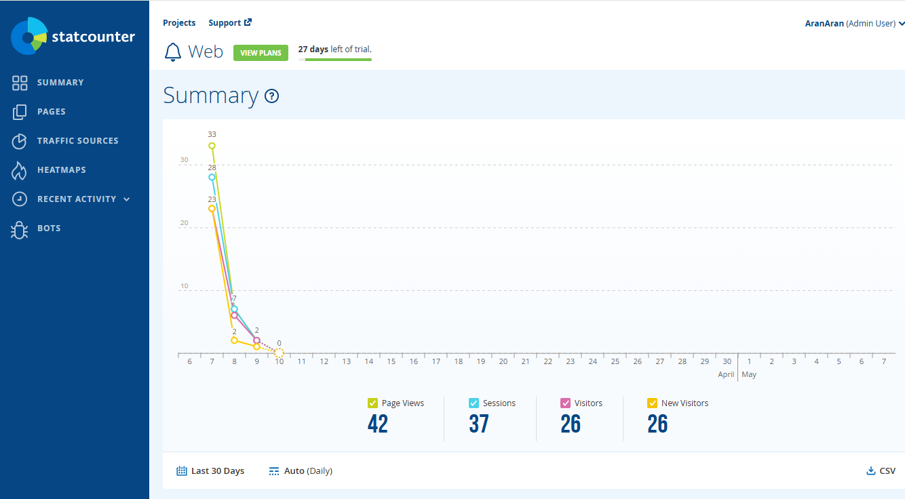
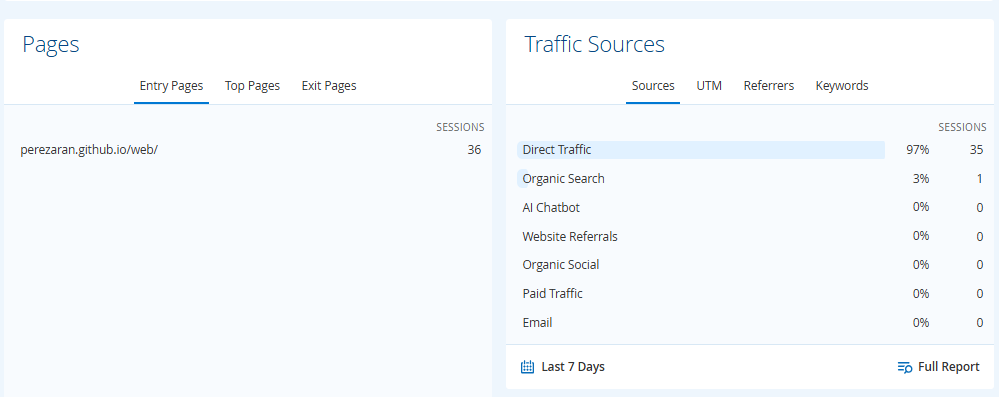
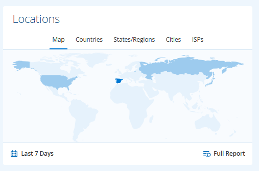
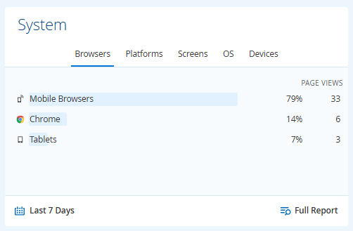
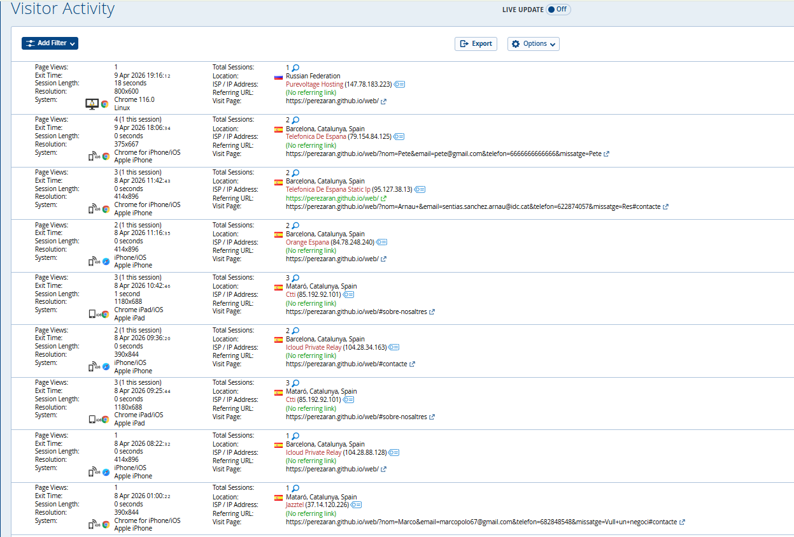
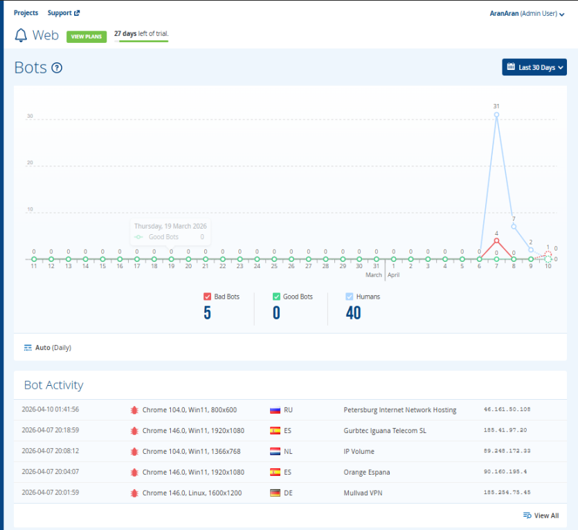

# EXPLICACIÓ CAPTURES STARCOUNTER

## Que es startcounter?
- Es una plataforma d'analítica web al núvol, independent i en temps real, dissenyada per rastrejar el comportament dels visitants, el trànsit i el rendiment de llocs web.

### Captura 1: Resum general (últims 30 dies)
Hi ha 26 visitants únics i tots són nous visitants. Això vol dir que encara no hi ha usuaris que tornin. La web atrau gent nova, però no fidelitza.

### Captura 2: Fonts de trànsit (últims 7 dies)
El 97% del trànsit (35 sessions) és Directe. No arriba gent ni de Google, ni xarxes socials, ni chatbots. La web només es visita si algú escriu la URL manualment

### Captura 3: Localització 
Pr figues no s'ha generat dades concretes, però la pestanya permet veure països, ciutats i proveïdors d'Internet. Clau per saber si la web arriba al públic objectiu de FoodLogistic.

### Captura 4: Sistema (dispositius i navegadors)
El 79% de les visites són amb Chrome mòbil. La web ha d'estar totalment optimitzada per a telèfons, no només per a ordinador.

### Captura 5: Activitat de visitants (sessions individuals)
La majoria de sessions duren 0 segons. Entren i surten immediatament. Això indica problemes greus de càrrega, disseny o contingut poc rellevant.

### Captura 6: Bots vs Humans
En els últims 30 dies hi ha 40 humans i només 5 bots bons. No hi ha atac de bots maliciosos. Les dades són fiables i representatives de comportament real.

