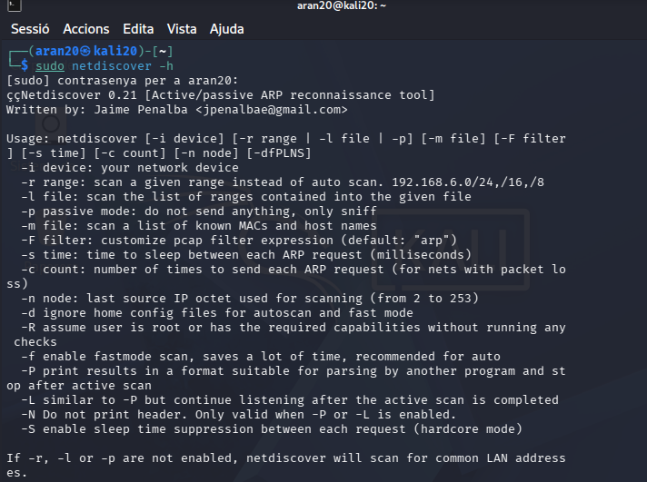
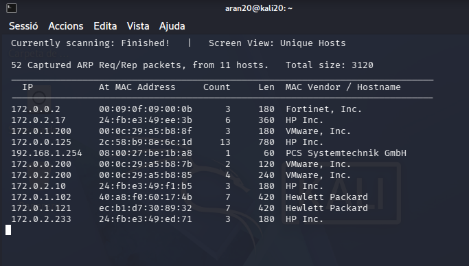
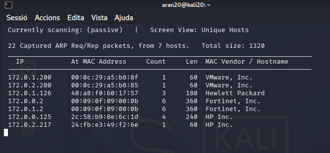
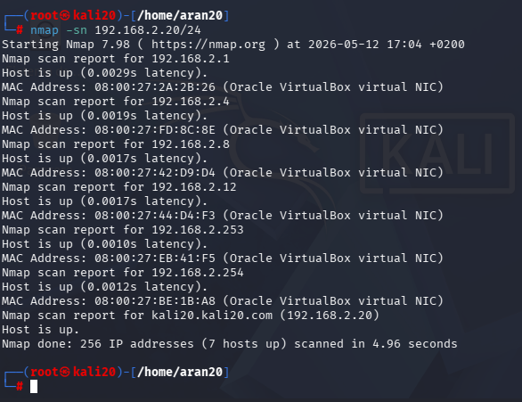
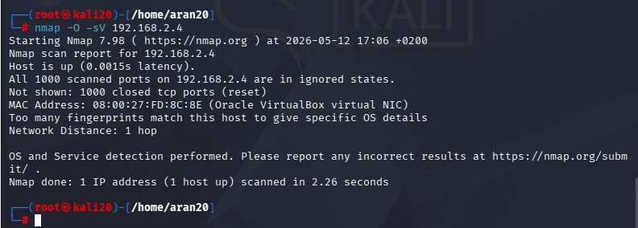
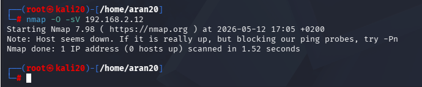

# Guia tècnica d’exploració de xarxa amb Kali Linux

### 1. Preparació i verificació de l’eina
Abans de començar, comprovo que Netdiscover funciona correctament i en reviso les opcions amb l’ajuda. 

### 2. Exploració activa amb Netdiscover
Faig un escaneig actiu enviant peticions ARP a tota la subxarxa 192.168.2.0/24. La comanda és sudo netdiscover -r 192.168.2.0/24. El resultat mostra 11 hosts actius, amb adreces IP, MAC i fabricants com VMware, HP o Fortinet. 

### 3. Exploració passiva amb Netdiscover
Ara executo sudo netdiscover -p per escoltar el trànsit ARP sense enviar res. Només apareixen 7 hosts, perquè depenc dels paquets que ja circulen per la xarxa. És un mètode molt més silenciós. 

### 4. Diferències entre els dos modes

| Mode actiu | Mode passiu |
| :--- | :--- |
| Envia peticions ARP a tota la xarxa | No envia res, només escolta |
| Detecta molts equips (fins i tot els que no estan parlant en aquell moment) | Només detecta equips que ja estan generant o responent trànsit ARP |
| Genera molt trànsit – fàcil de detectar per un IDS | Gairebé invisible – apropiat per a preparar atacs |
| Més ràpid per escombrar tota la subxarxa | Més lent perquè depèn del trànsit real |

### 5. Descobriment de hosts amb Nmap
Utilitzo Nmap per fer un “ping scan” i localitzar equips actius: sudo nmap -sn 192.168.2.0/24. Nmap em torna 7 hosts vius, incloent el router (192.168.2.1), el servidor (192.168.2.4), i la meva pròpia màquina. 

### 6. Intent de detecció de sistema operatiu i serveis
Provo d’identificar l’OS i les versions dels serveis amb sudo nmap -O -sV 192.168.2.4. El resultat indica que tots els ports escanejats estan tancats i no es pot determinar l’OS amb precisió.

### 7. Comparativa final: Netdiscover vs Nmap

| Característica | Netdiscover | Nmap |
| :--- | :--- | :--- |
| Protocol principal | ARP (nivell 2) | ICMP, TCP, UDP (nivell 3/4) |
| Mode passiu | Sí (-p) | No directe (es pot fer amb -sn però no és passiu real) |
| Detecció d’OS | No | Sí (-O, -A) |
| Escaneig de ports | No | Sí (molt complet) |
| Velocitat | Molt ràpid en actiu | Depèn de l’escaneig (pot ser lent) |
| Discreció | Passiu = molt discret. Actiu = sorollós | Depèn de les opcions (-T0 molt lent, -Pn evita ping) |