# Guia d’anàlisi de xarxa – Activitat Wireshark

## Configuració prèvia
Vaig obrir la configuració de la màquina Kali a VirtualBox.
Adaptador en mode pont, mode promiscu = Permet‑ho tot.

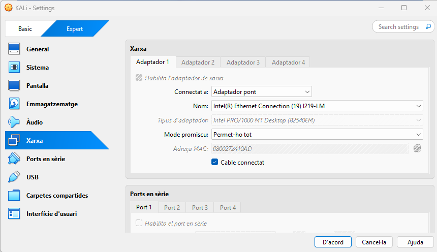

Dins Kali, vaig posar IP 192.168.2.20, gateway 192.168.2.254, DNS 8.8.8.8 i vaig fer ping al gateway per comprovar connexió 

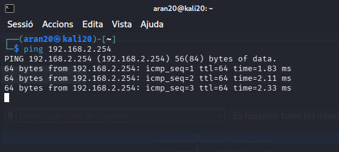

---

## Desenvolupament de l'activitat

### 1. ICMP 
Vaig iniciar captura a Wireshark i vaig fer ping 192.168.2.254.
Al paquet Echo request, el Type és 8.
Al paquet Echo reply, el Type és 0.
**Resposta:** petició d’eco = 8, resposta d’eco = 0.

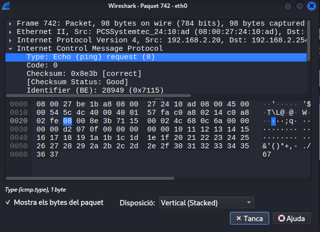
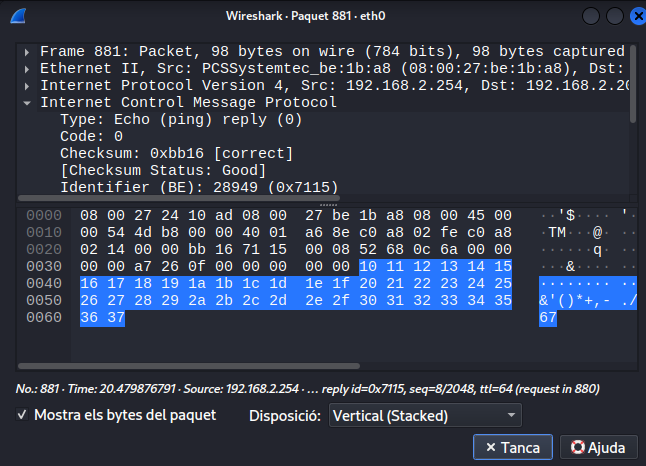

### 2. Trànsit de la màquina física
A la meva màquina física (amfitrió) la IP és 172.0.2.244.
Des de Kali vaig començar captura.
A la física vaig obrir navegador i vaig navegar.
A Wireshark vaig filtrar per `ip.addr == 172.0.2.244` i van aparèixer paquets UDP.
**Resposta:** Es veuen paquets UDP del servidor de Google cap a la IP de l’amfitrió. Sí que es pot capturar trànsit de la física.

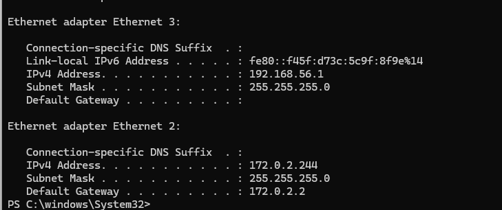
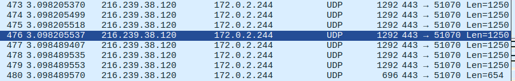

### 3. DNS petició 
A Kali vaig executar `nslookup www.xtec.cat`.
Filtre `dns`. Vaig trobar un paquet amb *Standard query* que demana www.xtec.cat.
**Resposta:** La petició consulta l’adreça A de www.xtec.cat.

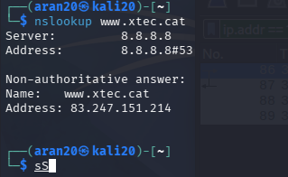

### 4. DNS resposta 
A la mateixa captura, paquet de resposta DNS.
Dins *Answers* posa `www.xtec.cat: addr 83.247.151.214`.
**Resposta:** La IP de www.xtec.cat és 83.247.151.214.

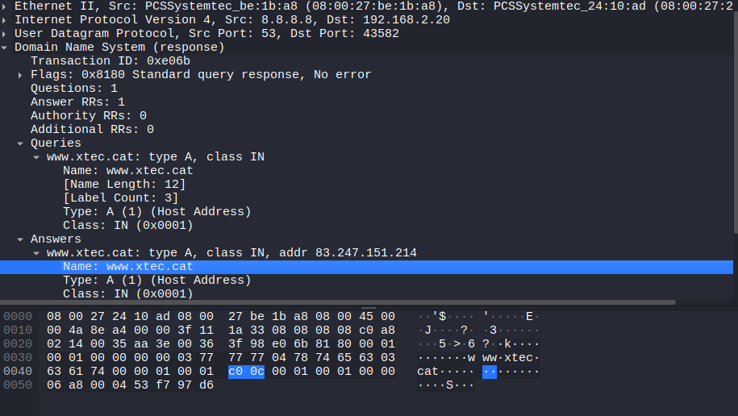

### 5. ARP: MAC del gateway i fabricant 
Filtre `arp`. Al paquet de resposta ARP la MAC font (Src) del gateway és `08:00:27:be:1b:a8`.
Consulto els 3 primers bytes `08:00:27` a una web i diu PCS Systemtechnik GmbH (Oracle VirtualBox).
**Resposta:** MAC gateway = `08:00:27:be:1b:a8`. Fabricant = PCS Systemtechnik (VirtualBox).

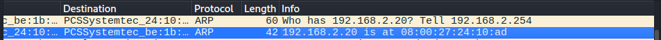
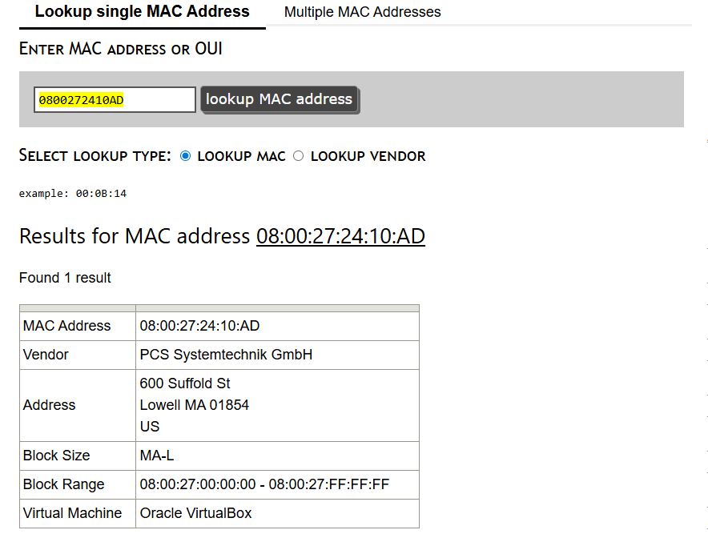

### 6. ARP: MAC de 192.168.1.1 
Obre `captura1.pcapng`. Filtre `arp and ip.addr == 192.168.1.1`.
A img15 veig la resposta: `192.168.1.1 is at d4:76:ea:0f:fd:58`.
**Resposta:** MAC = `d4:76:ea:0f:fd:58`.

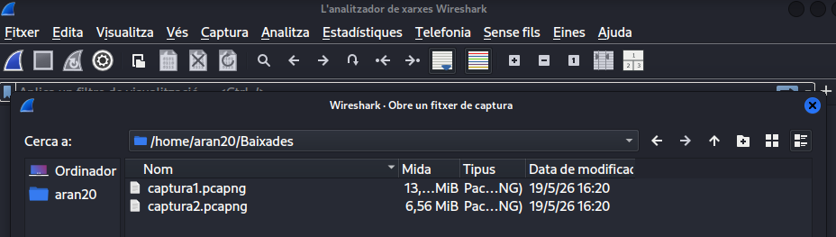
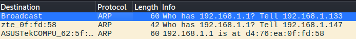
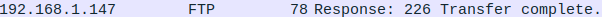

### 7. FTP: password i fitxer 
A `captura1.pcapng`, filtre `ftp`. Segueixo el flux TCP.
L’usuari envia `PASS contra` → password = contra.
Després `RETR README.txt` → fitxer = README.txt.
**Resposta:** password = contra, fitxer = README.txt.

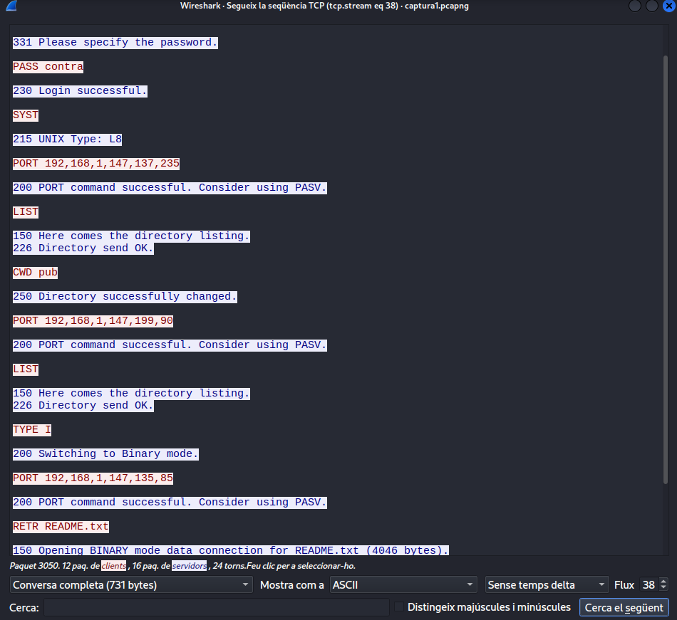

### 8. Telnet: què veia l’usuari? Nau espacial 
Filtre `telnet`. Segueixo el flux `tcp.stream eq 333` (img19).
Es veu un dibuix ASCII. L’usuari veia una nau espacial feta amb caràcters.
Els caràcters de la nau: O = < 8 8 = 0 < E I _ i espais.
**Resposta:** La nau es compon de O = < 8 8 = 0 < E I _.

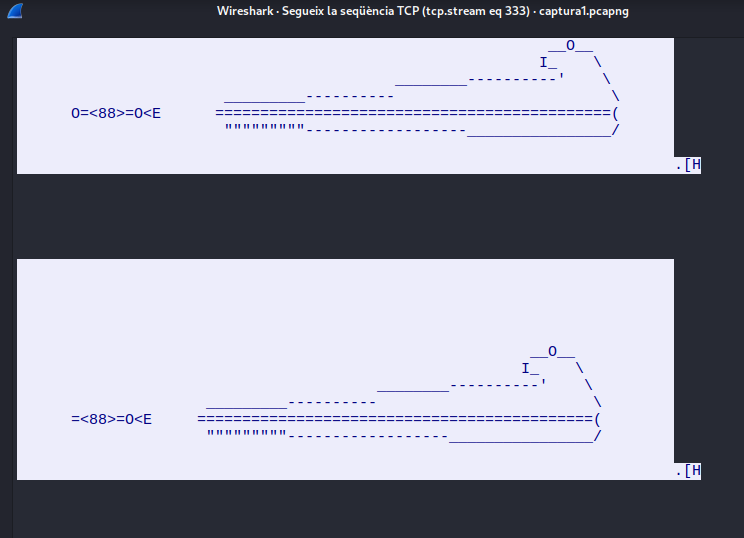

### 9. Telnet: domini de l’adreça 
A imatge la IP destí del Telnet és `94.142.241.111`.
No resol a cap domini conegut.
**Resposta:** IP 94.142.241.111 (sense domini).

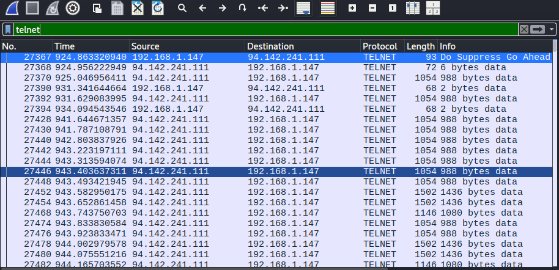

### 10. SSH: domini del servidor 
A `captura1.pcapng`, filtre `ssh`. IP del servidor = `205.166.94.17` 
**Resposta:** IP 205.166.94.17.

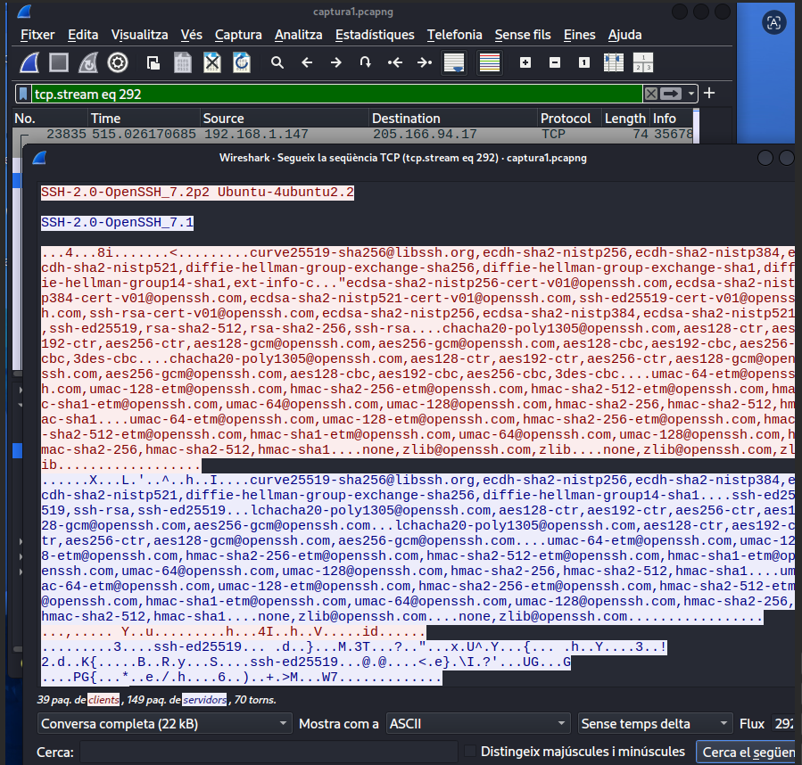
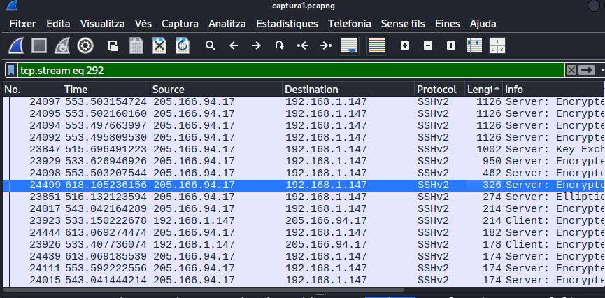

### 11. SSH: paquet de 326 bytes 
Filtre `frame.len == 326`. A imatge el paquet 24104 té longitud 326 i posa *Encrypted*.
Les dades estan xifrades, no es poden llegir.
**Resposta:** El paquet SSH està xifrat. No es veu el contingut.

### 12. Correu: robar missatge i extreure fitxer 
Obre `captura2.pcapng`. Filtre `smtp`. Segueixo el flux TCP.
El missatge és: `mensaje ultrasectro para el administrador`.
No hi ha cap fitxer adjunt.
**Resposta:** Missatge = mensaje ultrasectro para el administrador. No hi ha fitxer.

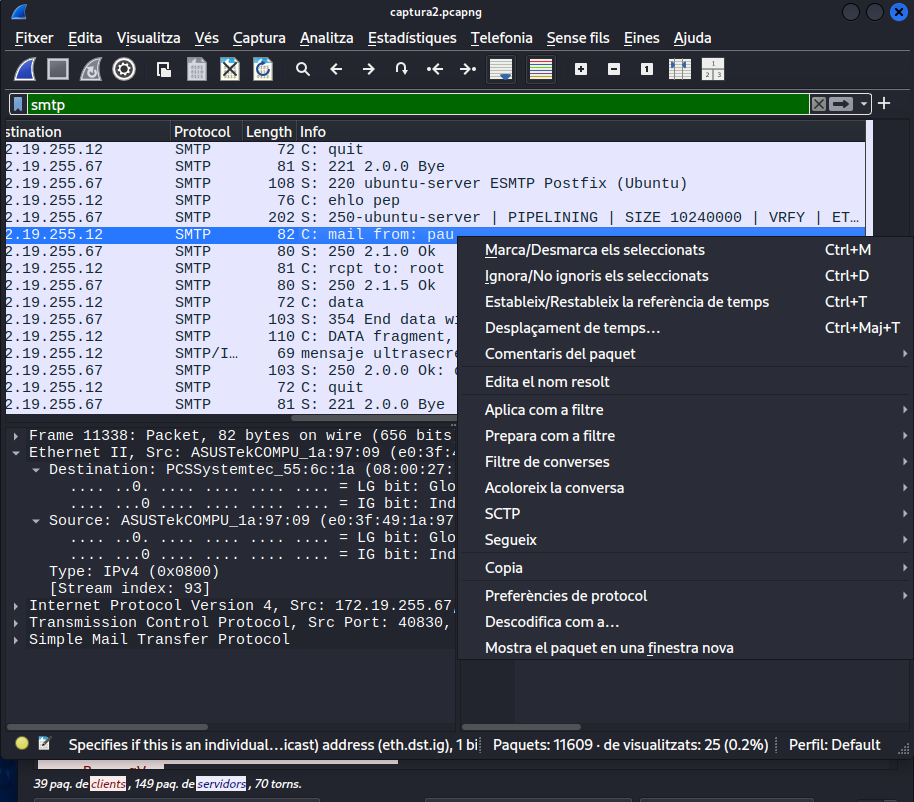
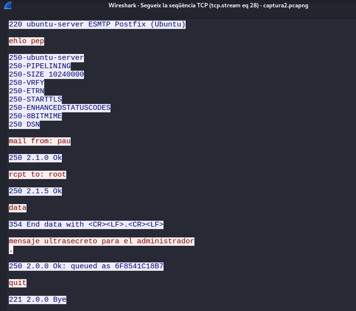
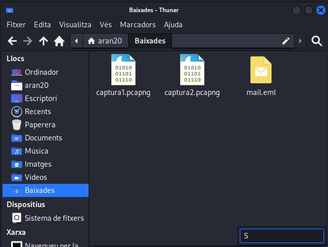